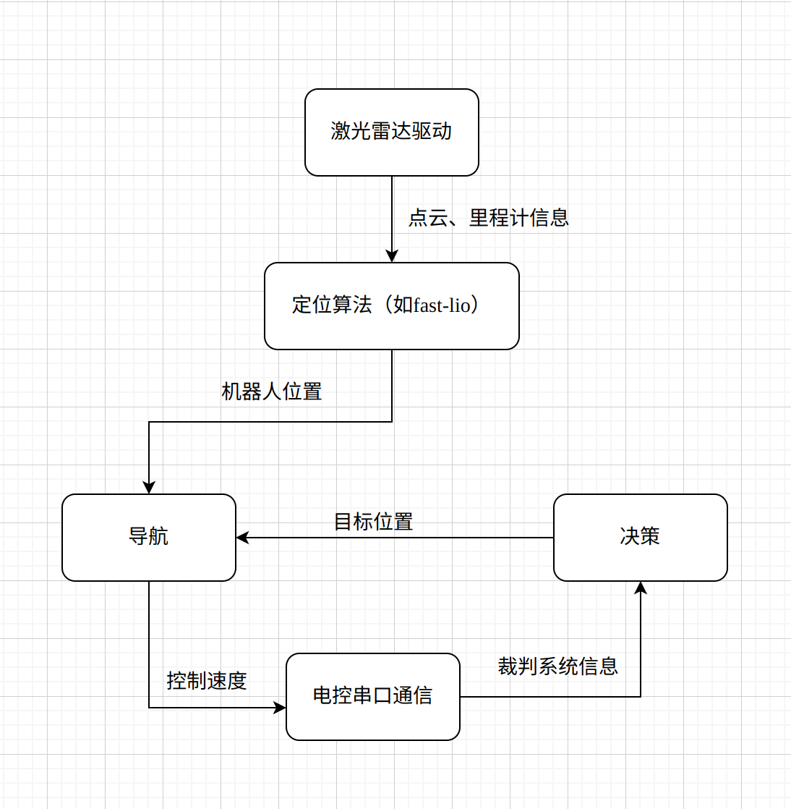
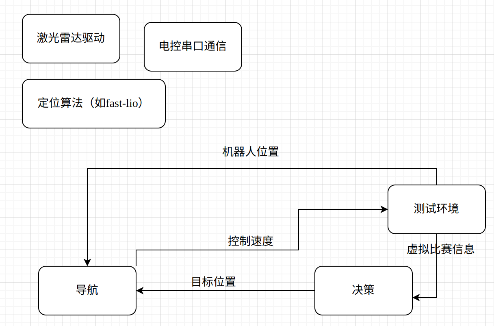

# 2025赛季视觉部第四次培训——ROS2
## ROS2安装
网址链接：https://fishros.org.cn/forum/topic/20/%E5%B0%8F%E9%B1%BC%E7%9A%84%E4%B8%80%E9%94%AE%E5%AE%89%E8%A3%85%E7%B3%BB%E5%88%97  
一键安装指令：`wget http://fishros.com/install -O fishros && . fishros`

## ROS2介绍
ROS，即Robot Operating System，是一套用于机器人开发的软件库和工具集。

##### ROS2主要提供了：
1. 话题、服务、参数、动作四种**通讯机制**，及其对应的管理、调试工具(命令行、rqt)
2. 机器人中常用的数据类型接口（比如速度geometry_msgs/msg/Twist、里程计数据sensor_msgs/msg/Imu等）
3. urdf机器人描述语言、rviz可视化界面、gazebo仿真环境、rosbag数据录制工具等

##### 为何要使用ROS：
1. 简化机器人开发任务、不重复造轮子
2. 模块化开发+通信机制，方便调试



比如，上图是一个哨兵程序的整体框架（简化版本）。在图中，每一个方框都代表一个ros中节点，每一个箭头都代表通过ros的某种通信方式去传递信息。  
其中，激光雷达的ros驱动是厂家提供的，定位算法网上有开源的fast-lio，除此之外还有导航、决策、串口通信节点等等，通过ros的通信机制，这些不同模块的节点之间可以传递信息、互相配合。  
由于ROS提供了统一的通信机制和数据接口，下载并使用其它人写好的模块（如上图的fast-lio）就变得非常方便



再比如，如果我们想在本地搭建的测试环境中测试一下自己写的导航和决策模块，我们不需要改变程序或者重新编译，只需要将这些信息进行图中这样的类似于重定向一样操作就行了

##### ROS官方示例  
0. 首先简单看一下ros2命令行格式
```
ros2 -h
ros2 run -h #等等
```
1. 听与说  
```
ros2 -h
ros2 run -h
ros2 run demo_nodes_cpp  listener  
#新建终端
ros2 run demo_nodes_cpp talker
```
2. 小海龟  
```
ros2 run turtlesim turtlesim_node
#新建终端
#键盘操控程序
ros2 run turtlesim turtle_teleop_key
```
运行后尝试查看以下指令
```
# 话题通信相关
ros2 topic list
ros2 topic echo /turtle1/cmd_vel #然后移动小海龟看看
ros2 topic info /turtle1/cmd_vel
ros2 interface show geometry_msgs/msg/Twist
ros2 topic pub /turtle1/cmd_vel geometry_msgs/msg/Twist "{linear: {x: 0.5, y: 0.0, z: 0.0}, angular: {x: 0.0, y: 0.0, z: 0.5}}"

# 参数通信相关
ros2 param list
ros2 param describe /turtlesim background_b
ros2 param set /turtlesim background_b 0
ros2 param set /turtlesim background_r 255
```

！[通信模型](Model.gif)

## 使用Cpp编写ROS2节点
```
#创建功能包
ros2 pkg create example_cpp --build-type ament_cmake --dependencies rclcpp

```