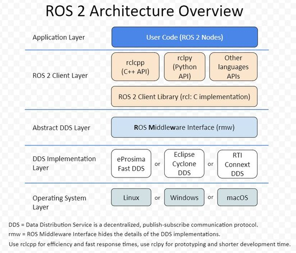

# 2025赛季视觉部第四次培训——ROS2基础
## ROS2安装
网址链接：https://fishros.org.cn/forum/topic/20/%E5%B0%8F%E9%B1%BC%E7%9A%84%E4%B8%80%E9%94%AE%E5%AE%89%E8%A3%85%E7%B3%BB%E5%88%97  
一键安装指令：`wget http://fishros.com/install -O fishros && . fishros`

ros安装位置：/opt/ros/\<distribution>

## ROS2介绍
ROS，即Robot Operating System，是一套用于机器人开发的软件库和工具集。

##### ROS2主要提供了：
1. 话题、服务、参数、动作四种**通讯机制**，及其对应的管理、调试工具(命令行、rqt)
2. 机器人中常用的数据类型接口（比如速度geometry_msgs/msg/Twist、里程计数据sensor_msgs/msg/Imu等）
3. urdf机器人描述语言、rviz可视化界面、gazebo仿真环境、rosbag数据录制工具等

##### 为何要使用ROS：
1. 简化机器人开发任务、不重复造轮子
2. 模块化开发+通信机制，方便调试


比如，上图是一个哨兵程序的整体框架（简化版本）。在图中，每一个方框都代表一个ros中节点，每一个箭头都代表通过ros的某种通信方式去传递信息。  
其中，激光雷达的ros驱动是厂家提供的，定位算法网上有开源的fast-lio，除此之外还有导航、决策、串口通信节点等等，通过ros的通信机制，这些不同模块的节点之间可以传递信息、互相配合。  
由于ROS提供了统一的通信机制和数据接口，下载并使用其它人写好的模块（如上图的fast-lio）就变得非常方便


再比如，如果我们想在本地搭建的测试环境中测试一下自己写的导航和决策模块，我们不需要改变程序或者重新编译，只需要将这些信息进行图中这样的类似于重定向一样操作就行了

##### ROS2初步上手
0. 首先简单看一下ros2命令的格式
```
ros2 -h
ros2 run -h #等等
```
1. 官方demo听与说  
```
ros2 run demo_nodes_cpp listener  
#新建终端
ros2 run demo_nodes_cpp talker
```
2. 官方demo小海龟  
```
ros2 run turtlesim turtlesim_node
#新建终端
#键盘操控程序
ros2 run turtlesim turtle_teleop_key
```
运行后尝试查看以下指令
```
# 话题通信相关
ros2 topic list
ros2 topic echo /turtle1/cmd_vel #然后移动小海龟看看
ros2 topic info /turtle1/cmd_vel
ros2 interface show geometry_msgs/msg/Twist
ros2 topic pub /turtle1/cmd_vel geometry_msgs/msg/Twist "{linear: {x: 0.5, y: 0.0, z: 0.0}, angular: {x: 0.0, y: 0.0, z: 0.5}}"

# 参数通信相关
ros2 param list
ros2 param describe /turtlesim background_b
ros2 param set /turtlesim background_b 0
ros2 param set /turtlesim background_r 255
```
来看一个简单演示ros2通信模型的动图
！[通信模型](Model.gif)

## 使用rclcpp编写ROS2话题通信节点
rcl，即ros client library，是ros的c++接口
1. 创建工作空间
```
mkdir -p ws/src
cd ws/src
```
2. 创建功能包
```
ros2 pkg create example_topic_rclcpp --build-type ament_cmake --dependencies rclcpp
```

此时文件目录
```
.
└── src
    └── example_topic_rclcpp
        ├── CMakeLists.txt
        ├── include
        │   └── example_topic_rclcpp
        ├── package.xml
        └── src
```
3. 在src中添加话题发布节点的cpp文件

    在ros2中，每一个节点都是rclcpp::Node类或者其派生类的一个实例。

    所有的话题发布者、话题订阅、服务端、客户端，都必须要属于一个节点（也就是说，一定要通过某个节点去创建）

    以下为一个话题发布cpp节点的示例
```
#include "rclcpp/rclcpp.hpp"
#include "std_msgs/msg/string.hpp"

class TopicPublisher01 : public rclcpp::Node
{
public:
    // 构造函数,有一个参数为节点名称
    TopicPublisher01(std::string name) : Node(name)
    {
        RCLCPP_INFO(this->get_logger(), "大家好，我是%s.", name.c_str());
        // 创建发布者，指定该发布者发布的数据类型和发布的话题名称command
        command_publisher_ = this->create_publisher<std_msgs::msg::String>("command", 10);
        // 创建定时器，500ms为周期，定时调用timer_callback回调函数
        timer_ = this->create_wall_timer(std::chrono::milliseconds(500),    std::bind(&TopicPublisher01::timer_callback, this));
    }

private:
    void timer_callback()
    {
        // 创建消息
        std_msgs::msg::String message;
        message.data = "forward";
        // 日志打印
        RCLCPP_INFO(this->get_logger(), "Publishing: '%s'", message.data.c_str());
        // 发布消息
        command_publisher_->publish(message);
    }
    // 声名定时器指针
    rclcpp::TimerBase::SharedPtr timer_;
    // 声明话题发布者指针
    rclcpp::Publisher<std_msgs::msg::String>::SharedPtr command_publisher_;
};

int main(int argc, char **argv)
{
    //初始化ros系统
    rclcpp::init(argc, argv);
    /*创建对应节点的共享指针对象*/
    auto node = std::make_shared<TopicPublisher01>("topic_publisher_01");
    //spin()函数，会让程序阻塞在这一步并开始不停地检测被spin的节点中有没有（与它的计时器或者订阅者绑定的）回调函数被触发
    rclcpp::spin(node);
    rclcpp::shutdown();
    return 0;
}
```
通常，在节点类的构造函数中，我们会进行一些初始化的工作：比如话题发布者、订阅者的构造，参数的读取等等

当然，你也不一定要按照这种面向对象的写法写，只要创建了节点、在这个节点中创建了话题发布者、然后发布数据就行，比如下面一种比较简单粗暴的写法(不是很推荐，但这样写也不会出啥问题就是了)
```
int main(int argc, char **argv)
{
    rclcpp::init(argc, argv)
    auto node = std::make_shared<Node>("test"); //创建节点
    auto pub = node->creat_publisher<xxxx>(xxxxx); //创建发布者
    while(True){
        std_msgs::msg::String message;
        message.data = "forward";
        RCLCPP_INFO(this->get_logger(), "Publishing: '%s'", message.data.c_str());
        pub->publish(message); //发布数据
        sleep(500);
    }
    return 0;
}
```

还有其对应的话题接受者cpp实现
```
#include "rclcpp/rclcpp.hpp"
#include "std_msgs/msg/string.hpp"

class TopicSubscribe01 : public rclcpp::Node
{
public:
    TopicSubscribe01(std::string name) : Node(name)
    {
        RCLCPP_INFO(this->get_logger(), "大家好，我是%s.", name.c_str());
          // 创建一个订阅者订阅话题，指定其接受的话题的数据结构以及订阅的话题名称command
        command_subscribe_ = this->create_subscription<std_msgs::msg::String>("command", 10, std::bind(&TopicSubscribe01::command_callback, this, std::placeholders::_1));
    }

private:
     // 声明一个订阅者
    rclcpp::Subscription<std_msgs::msg::String>::SharedPtr command_subscribe_;
     // 收到话题数据的回调函数
    void command_callback(const std_msgs::msg::String::SharedPtr msg)
    {
        double speed = 0.0f;
        if(msg->data == "forward")
        {
            speed = 0.2f;
        }
        RCLCPP_INFO(this->get_logger(), "收到[%s]指令，发送速度 %f", msg->data.c_str(),speed);
    }
};
int main(int argc, char **argv)
{
    rclcpp::init(argc, argv);
    /*创建对应节点的共享指针对象*/
    auto node = std::make_shared<TopicSubscribe01>("topic_subscribe_01");
    /* 运行节点，并检测退出信号*/
    rclcpp::spin(node);
    rclcpp::shutdown();
    return 0;
}
```
在编译功能包之前，要修改对应的package.xml和CMakeLists.txt
package.xml中加上
```
//声明一下功能包的依赖，便于ros2进行功能包的依赖管理
    <depend>rclcpp</depend>
    <depend>std_msgs</depend>
```
CMakeLists.txt中加上
```
find_package(rclcpp REQUIRED)
find_package(std_msgs REQUIRED)


add_executable(topic_publisher_01 src/topic_publisher_01.cpp)
ament_target_dependencies(topic_publisher_01 rclcpp std_msgs)

add_executable(topic_subscribe_01 src/topic_subscribe_01.cpp)
ament_target_dependencies(topic_subscribe_01 rclcpp std_msgs)

//install这一步是把最终的可执行文件放到install/目录下，这样执行ros2 run的时候就能找到对应的可执行文件
install(TARGETS topic_publisher_01 topic_subscribe_01
DESTINATION lib/${PROJECT_NAME}
)
```
随后在工作空间目录下执行
```
colcon build
```
即可编译功能包（当有多个功能包时，可以使用colcon build --packages-select \<package_name> 来编译单独的功能包）
```
ros2 run example_topic_rclcpp topic_publisher_01
ros2 run example_topic_rclcpp topic_subscribez_01
```
## 使用rclcpp实现服务通信

服务端cpp实现
```
#include <rclcpp/rclcpp.hpp>
#include "example_interfaces/srv/add_two_ints.hpp"

class ServiceClient01 : public rclcpp::Node {
public:
  // 构造函数,有一个参数为节点名称
  ServiceClient01(std::string name) : Node(name) {
    RCLCPP_INFO(this->get_logger(), "节点已启动：%s.", name.c_str());
    // 创建客户端
    client_ = this->create_client<example_interfaces::srv::AddTwoInts>("add_two_ints_srv");
  }

  void send_request(int a, int b) {
    RCLCPP_INFO(this->get_logger(), "计算%d+%d", a, b);

    // 1.等待服务端上线
    while (!client_->wait_for_service(std::chrono::seconds(1))) {
      //等待时检测rclcpp的状态
      if (!rclcpp::ok()) {
        RCLCPP_ERROR(this->get_logger(), "等待服务的过程中被打断...");
        return;
      }
      RCLCPP_INFO(this->get_logger(), "等待服务端上线中");
    }

    // 2.构造请求的
    auto request =
      std::make_shared<example_interfaces::srv::AddTwoInts_Request>();
    request->a = a;
    request->b = b;

    // 3.发送异步请求，然后等待返回，返回时调用回调函数
    client_->async_send_request(
      request, std::bind(&ServiceClient01::result_callback_, this,
                         std::placeholders::_1));
  };

private:
  // 声明客户端
  rclcpp::Client<example_interfaces::srv::AddTwoInts>::SharedPtr client_;

  void result_callback_(
    rclcpp::Client<example_interfaces::srv::AddTwoInts>::SharedFuture
      result_future) {
    auto response = result_future.get();
    RCLCPP_INFO(this->get_logger(), "计算结果：%ld", response->sum);
  }
};
int main(int argc, char** argv) {
  rclcpp::init(argc, argv);
  /*创建对应节点的共享指针对象*/
  auto node = std::make_shared<ServiceClient01>("service_client_01");
  node->send_request(1, 1);
  rclcpp::spin(node);
  rclcpp::shutdown();
  return 0;
}
```
客户请求端cpp实现
```
#include <rclcpp/rclcpp.hpp>
#include "example_interfaces/srv/add_two_ints.hpp"

class ServiceClient01 : public rclcpp::Node {
public:
  // 构造函数,有一个参数为节点名称
  ServiceClient01(std::string name) : Node(name) {
    RCLCPP_INFO(this->get_logger(), "节点已启动：%s.", name.c_str());
    // 创建客户端
    client_ = this->create_client<example_interfaces::srv::AddTwoInts>("add_two_ints_srv");
  }

  void send_request(int a, int b) {
    RCLCPP_INFO(this->get_logger(), "计算%d+%d", a, b);

    // 1.等待服务端上线
    while (!client_->wait_for_service(std::chrono::seconds(1))) {
      //等待时检测rclcpp的状态
      if (!rclcpp::ok()) {
        RCLCPP_ERROR(this->get_logger(), "等待服务的过程中被打断...");
        return;
      }
      RCLCPP_INFO(this->get_logger(), "等待服务端上线中");
    }

    // 2.构造请求的
    auto request =
      std::make_shared<example_interfaces::srv::AddTwoInts_Request>();
    request->a = a;
    request->b = b;

    // 3.发送异步请求，然后等待返回，返回时调用回调函数
    client_->async_send_request(
      request, std::bind(&ServiceClient01::result_callback_, this,
                         std::placeholders::_1));
  };

private:
  // 声明客户端
  rclcpp::Client<example_interfaces::srv::AddTwoInts>::SharedPtr client_;

  void result_callback_(
    rclcpp::Client<example_interfaces::srv::AddTwoInts>::SharedFuture
      result_future) {
    auto response = result_future.get();
    RCLCPP_INFO(this->get_logger(), "计算结果：%ld", response->sum);
  }
};
int main(int argc, char** argv) {
  rclcpp::init(argc, argv);
  /*创建对应节点的共享指针对象*/
  auto node = std::make_shared<ServiceClient01>("service_client_01");
  node->send_request(1, 1);
  rclcpp::spin(node);
  rclcpp::shutdown();
  return 0;
}
```
CMakeList和package.xml也要做对应的更改，需要添加的内容和话题通信示例里的差不多，只不过我们这次依赖的接口不是std_msgs而是example_interfaces  
编译，source，运行
```
colcon build --packages-select example_service_rclcpp
source install/setup.bash
ros2 run example_service_rclcpp 
```
## ROS2自定义接口实现
在上面两个示例中，我们可以看到两者分别通过std_msgs::msg::string和example_interfaces::srv::AddTwoInts两个接口实现的，我们可以看看两个这两个接口分别是怎么定义的
```
ros2 interface show std_msgs/msg/String
ros2 interface show example_interfaces/srv/AddTwoInts
```
在实际的程序中，我们可能想要按照我们自己需要的格式在节点间通信，这时候就可以去自定义接口
以下为新建一个自定义话题通信接口的示例
```
#不一定要新建一个功能包，把新定义的接口放在已有的功能包中也行
ros2 pkg create my_interface --build-type ament_cmake --dependencies rclcpp
```
在功能包底下创建一个msg文件目录，在其中添加Robot.msg文件
```
string name
int32[] attribute #这个数组其实是以std::vector的形式在c++中实现的
geometry_msgs/Twist twist
```
对于有自定义消息接口的功能包，要在CMakeLists.txt和package.xml中分别加上
```
#让colcon能根据自定义的msg文件生成对应的接口cpp代码
find_package(rosidl_default_generators REQUIRED)
rosidl_generate_interfaces(${PROJECT_NAME}
  "msg/Robot.msg"
  DEPENDENCIES geometry_msgs   # Add packages that above messages depend on, if any
)
```
```
<depend>rosidl_default_generators</depend>
<exec_depend>rosidl_default_runtime</exec_depend>
<member_of_group>rosidl_interface_packages</member_of_group>
```
此外，在我们的自定义接口中还使用了geometry_msgs这个额外的包中的接口（geometry_msgs/Twist），所以还需额外加上对于geometry_msgs的依赖
```
find_package(geometry_msgs REQUIRED)
#还有上文中的rosidl_generate_interfaces()里的DEPENDENCIES
```
```
<depend>geometry_msgs</depend>
```
然后编译此包即可
对于要使用这个自定义接口的功能包，也不要忘记在其CMakeLists.txt和package.xml中指明对于my_interface功能包的依赖

示例
```
#include "rclcpp/rclcpp.hpp"
#include "my_interface/msg/robot.hpp"

class TopicPublisher01 : public rclcpp::Node
{
public:
    // 构造函数,有一个参数为节点名称
    TopicPublisher01(std::string name) : Node(name)
    {
        RCLCPP_INFO(this->get_logger(), "大家好，我是%s.", name.c_str());
        // 创建发布者，指定该发布者发布的数据类型和发布的话题名称command
        command_publisher_ = this->create_publisher<my_interface::msg::Robot>("robot", 10);
        // 创建定时器，500ms为周期，定时调用timer_callback回调函数
        timer_ = this->create_wall_timer(std::chrono::milliseconds(500),    std::bind(&TopicPublisher01::timer_callback, this));
    }

private:
    void timer_callback()
    {
        // 创建消息
        my_interface::msg::Robot message;
        message.name = "A";
        message.attribute.push_back(1);
        message.attribute.push_back(2);
        message.twist.angular.x = 1;
        message.twist.angular.y = 2;
        message.twist.angular.z = 3;
        message.twist.linear.x = 4;
        message.twist.linear.y = 5;
        message.twist.linear.z = 6;
        // 日志打印
        RCLCPP_INFO(this->get_logger(), "Publishing: '%s'", message.name.c_str());
        command_publisher_->publish(message);
    }
    // 声名定时器指针
    rclcpp::TimerBase::SharedPtr timer_;
    // 声明话题发布者指针
    rclcpp::Publisher<my_interface::msg::Robot>::SharedPtr command_publisher_;
};

int main(int argc, char **argv)
{
    //初始化ros系统
    rclcpp::init(argc, argv);
    /*创建对应节点的共享指针对象*/
    auto node = std::make_shared<TopicPublisher01>("topic_publisher_01");
    //spin()函数，会让程序阻塞在这一步并开始不停地检测被spin的节点中有没有（与它的计时器或者订阅者绑定的）回调函数被触发
    rclcpp::spin(node);
    rclcpp::shutdown();
    return 0;
}
```
```
find_package(rclcpp REQUIRED)
find_package(my_interface REQUIRED)


add_executable(robot_publisher src/publisher.cpp)
ament_target_dependencies(robot_publisher rclcpp my_interface)

install(TARGETS robot_publisher 
  DESTINATION lib/${PROJECT_NAME}
)
```
```
<depend>rclcpp</depend>
<depend>my_interface</depend>
```
编译运行程序后，在source这个工作空间目录下的install/setup.bash后，即可`ros2 topic echo /robot`查看发布的内容

## ROS2参数通信实现
1. 参数通信是什么  
A parameter is a configuration value of a node. You can think of parameters as node settings.  
参数是节点的一个配置值，你可以认为参数是一个节点的设置
比如一开始小乌龟demo里让大家尝试的`ros2 param set /turtlesim background_b 0`就是参数通信。background_b 0 是/turtlesim节点的一个参数

示例程序(CMakeLists和package.xml不做过多阐述，加上rclcpp依赖即可)
```
#include  <rclcpp/rclcpp.hpp>

class ParamNode: public rclcpp::Node
{
    public:
        ParamNode(std::string name):Node(name){
            //先声明my_param这个参数，并将其默认值设置为-1，没有declare_parameter也不会报错，但是get_parameter就会失效，ros系统也无法识别这个参数
            this->declare_parameter("my_param", -1);
            this->get_parameter("my_param", my_param);
            RCLCPP_INFO(this->get_logger(), "Parameter my_param: %d", my_param);
        }
    private:
        int my_param;
};
int main(int argc, char ** argv)
{
    rclcpp::init(argc, argv);
    auto my_node = std::make_shared<ParamNode>("param_node");
    rclcpp::shutdown();
    return 0;
}
```
然后再运行程序时配置参数的值
```
ros2 run example_param_rclcpp param_node --ros-args -p my_param:=100
```
或者写yaml参数配置文件
```
#配置文件
#节点名
param_node:
  ros__parameters:
    my_param: 100
#不同的节点要分开来写
```
运行程序
```
ros2 run example_param_rclcpp param_node --ros-args --params-file /home/qep/WorkSpace/RM2025/ROS2tutorial/ros_ws/src/example_param_rclcpp/config/params.yaml
```
通常，我们会把话题名以及算法中经常要调试的参数作为ros param，方便我们进行话题的重映射和参数的调试


（除了上述三种通信方式外，还有一种通信模式叫动作通信，由于平时使用的不多而且服务通信的模型差别不大（多了一个持续的feedback），此处不做过多阐述，可之后自行查资料实现）

## TF
TF是transfrom的缩写，是用来表示一个坐标系在另一个坐标系中的位姿。在ros2系统里，一个良好的tf系统应该是树状的（这是显然的，如果连成图的话就可能会出现矛盾）。ros2中的tf是使用话题通信实现的，接口是geometry_msgs/msg/TransformStamped

发布TF
```
geometry_msgs::msg::TransformStamped transform_stamped;
transform_stamped.header.stamp = this->get_clock()->now();
transform_stamped.header.frame_id = "world";
transform_stamped.child_frame_id = "robot";
transform_stamped.transform.translation.x = 1.0;
transform_stamped.transform.translation.y = 2.0;
transform_stamped.transform.translation.z = 0.0;
transform_stamped.transform.rotation.x = 0.0;
transform_stamped.transform.rotation.y = 0.0;
transform_stamped.transform.rotation.z = 0.0;
transform_stamped.transform.rotation.w = 1.0;
tf_broadcaster_->sendTransform(transform_stamped);
```
查找tf
```
geometry_msgs::msg::TransformStamped transform_stamped;
transform_stamped = tf_buffer_->lookupTransform("world", "robot", tf2::TimePointZero);
```
依赖：tf2_ros、geometry_msgs

可以使用rqt插件rqt_tf_tree查看tf树
```
ros2 run rqt_tf_tree rqt_tf_tree 
```

## Launch启动工具介绍

对于一个机器人系统来说，往往由很多个不同功能的节点组成，启动一个机器人系统时往往需要启动多个节点，同时根据应用场景和机器人的不同，每个节点还会有不同的配置项。

如果每个节点我们都开一个新终端，敲ros2 run指令并写一堆参数，这是多么浪费生命且令人绝望的事情。

可不可以编写一个类似于脚本的文件来管理节点的启动呢？

ROS2设计时就为我们想好了，为我们设计了一套完整的语法和规则的文件来帮助我们组织节点的启动，这个武器就叫launch文件。

launch文件允许我们同时启动和配置多个包含 ROS 2 节点的可执行文件

ROS2的launch文件有三种格式，python、xml、yaml。其中ROS2官方推荐的时python方式编写launch文件。 原因在于，相较于XML和YAML，Python是一个编程语言，更加的灵活，我们可以利用Python的很多库来做一些其他工作（比如创建一些初始化的目录等）。

## Launch文件示例
接下来，我们用launch文件启动一下我们最开始的话题demo的话题发布节点和话题订阅节点
```
#demo.launch.py
from launch import LaunchDescription
from launch_ros.actions import Node

def generate_launch_description():
    node_pub = Node(
        package="example_topic_rclcpp",
        executable="topic_publisher_01"
    )
    node_sub = Node(
        package="example_topic_rclcpp",
        executable="topic_subscribe_01"
    )
    
    launch_description = LaunchDescription(
        [node_pub, node_sub])
    # 返回让ROS2根据launch描述执行节点
    return launch_description
```
此外，由于我们在终端输入ros2 launch \<pkg> \<launchfile> 时，ros系统是去install文件夹中寻找的，所以还需在CMakeList中加上
```
install(DIRECTORY launch
  DESTINATION share/${PROJECT_NAME})
```
然后再colcon build （最好是 colcon build --symlink-install创建软链接，这样之后如果单单是修改文件而不是创建文件的话就不用再build库）一次，再在终端中输入
```
ros2 launch example_topic_rclcpp demo.launch.py
```
即可看到有两个节点跑了起来
launch的python格式中，Node构造函数的其他常用参数为如下
```
node = Node(
        package='your_package_name',
        executable='your_executable',
        name='my_node', #在这里你可以重新给节点命名，这个名字会覆盖你再cpp文件里给Node对象构造函数传递的那个string类型的名字
        output='screen', #输出到终端还是log文件，log文件在.ros/log中查看
        parameters=[param_file_path]  # 指定参数文件
    )
```

此外，一个launch.py文件还可以include另一个launch.py文件，从而达成launch文件的模块划分。
具体写法大致就是
```
#首先要import头文件
from launch.actions import IncludeLaunchDescription
from launch.launch_description_sources import PythonLaunchDescriptionSource
from ament_index_python.packages import get_package_share_directory

def generate_launch_description():
    # 获取子launch文件的路径
    child_launch_file = os.path.join(
      #这个get_package_share_directory,顾名思义是在intall文件夹的share文件夹下找
        get_package_share_directory('your_package_name'),
        'launch',
        'child_launch.py'  # 子launch文件名
    )
    #和单独的节点一样，直接加到LaunchDescription里就好
    return LaunchDescription([
        # Include child_launch.py 文件
        IncludeLaunchDescription(
            PythonLaunchDescriptionSource(child_launch_file)
        )
    ])
```
## ros2架构



简单粗略地介绍一下

DDS（data distribution service）是第三方工具，负责实现具体的通信，可以替换成不同厂家提供的dds，不过一般没啥替换的需要（ros2自带为fast_dds）

rmw ros中间件，主要负责把各种dds按照ros的逻辑封装成统一的接口

rcl 把ros的这些接口封装到到不同的变成语言上，比如c++和python
### QOS
qos，即quality of service， 决定了通信时采用的策略。比如通信时是更优先保障消息的实时性还是保障我们接受到了所有的消息。
在传输一些比如点云等数据量较大，而且对实时性要求较高的数据时，就可以使用优先保障消息实时性的策略，比如BestEffrot

qos常用配置项目
#### History

1. Keep last: 只缓存最新的N个数据，N可通过Depth的Queue size配置。

2. Keep all: 缓存所有的数据，但是受限于DDS底层的资源限制。

#### Depth

也就是Queue size（在构造发布者/接受者时，只填写一个整型就代表queue size，代表储存数据的队列大小）。只有当History设置为Keep last时有效。

#### Reliability
Best effort: 尽力传送数据，但是网络不稳定可能会丢弃一些数据。

Reliable: 确保数据被传送到，可能会重传多次，导致数据延时严重。

还有很多其它的可以配置的项，但平常用到的不多，就不细讲了

rclcpp中qos配置示例
```
auto qos = rclcpp::QoS(rclcpp::KeepLast(10)).reliable();//.reliable()这些函数会添加qos配置并返回这个Qos的引用
//qos构造时必须要有history策略
command_publisher_ = this->create_publisher<std_msgs::msg::String>("command", qos);
```


注释：
1. 发布者和接受者可以使用不同的Qos策略，但有些策略是互相不兼容的，具体可以看看下面的链接
2. 当你的代码逻辑没问题，但接受/发送的数据的频率优点问题时（可以用ros2 topic hz /topic_name等查看），可以优先查看发布数据的频率（计时器或循环的sleep）和qos

关于更多的ros2中qos配置相关的知识，可以参看下面的教程

参考资料：https://mp.weixin.qq.com/s/J63fO4c_QIseLGQd5W2fAw

## 常用调试工具
1. ros2cli
ROS 2 Command-Line Interface，就是ros2 run，ros2 topic等一套东西，一开始已经演示的差不多了
2. rqt
rqt，即ros qt，是使用qt写的ros调试界面
常用指令
```
rqt
rqt_graph
#rqt_tf_tree第一次使用可能需要安装 sudo apt install ros-<ros2_distro>-rqt-tf-tree
ros2 run rqt_tf_tree rqt_tf_tree
```
3. rviz2
可以将点云等数据可视化，也可使用visuallization_msgs接口发布一些话题，进行调试
**可以使用foxglove替代，foxglove使用起来相对更方便**

4. rosbag
rosbag能录制话题数据，然后再播放。我们可以在测试机器人的时候开启录制，如果出了问题再在本地播放录制的数据进行debug。需要注意的是，如果录制的话题使用的是自定义接口，那么在执行ros2 bag前要先source。
```
#录一个话题
ros2 bag record /topic-name
#录制多个话题
ros2 bag record topic-name1  topic-name2
#录制所有话题
ros2 bag record -a
#自定义输出文件名字
ros2 bag record -o file-name topic-name
#查看录制的bag的信息
ros2 bag info <bag_name>
#播放数据
ros2 bag play <bag_name>
#循环播放
ros2 bag play <bag_name>  -l
#播放倍速
ros2 bag play <bag_name> -r 10
```


## 推荐参考资料
1. https://fishros.com/d2lros2/#/ 鱼香动手学ros
2. https://docs.ros.org/en/humble/index.html ros2humble官方文档

## 作业
0. 如果是第一次接触ros，可以先把本教程内的代码自己跑一遍玩一玩
1. 查阅资料，自定义一个服务通信的接口并使用
2. 查阅动作通信相关资料，实现一个简单的动作通信demo。这个demo中客户端会给服务端发送一个s作为机器人要前进的距离，服务端会以一个速度v前进（服务端会不断地给客户端反馈剩余距离），当剩余距离减少到0时判定为这个动作成功了，但如果超过常数time_limit的时间还没有走完，就判定为动作失败，这个动作失败后客户端会把距离减半并重新发送请求，直到成功。其中s、v和time_limit这两个常数都要以ros param的形式存在并可以在一个yaml文件中修改，客户端和服务端两个节点要能使用一个launch文件启动。
